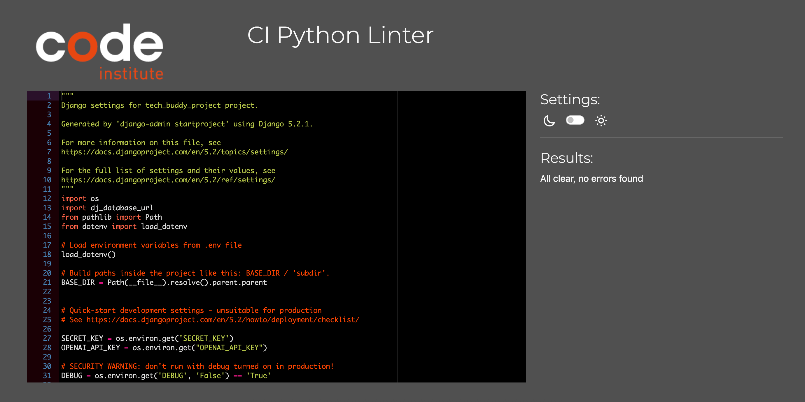
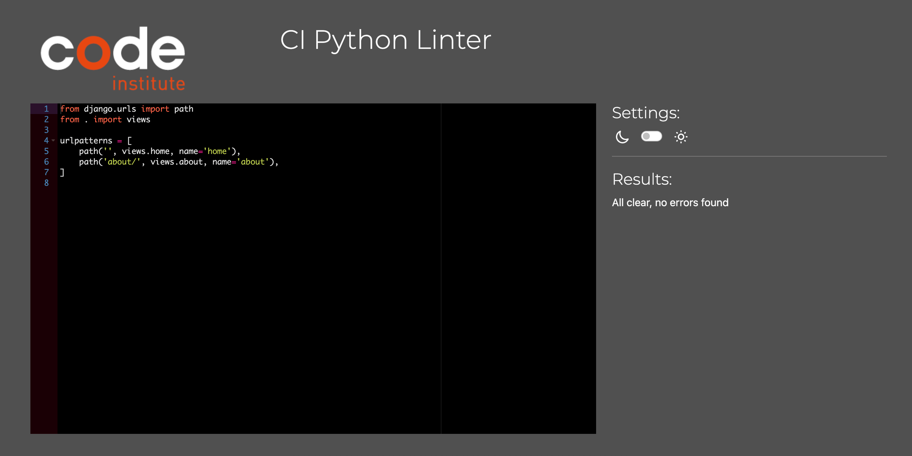
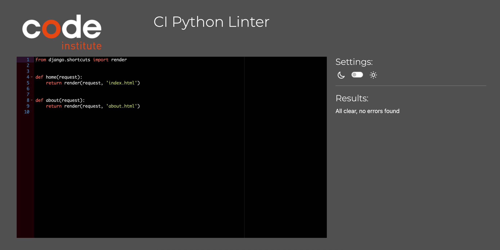
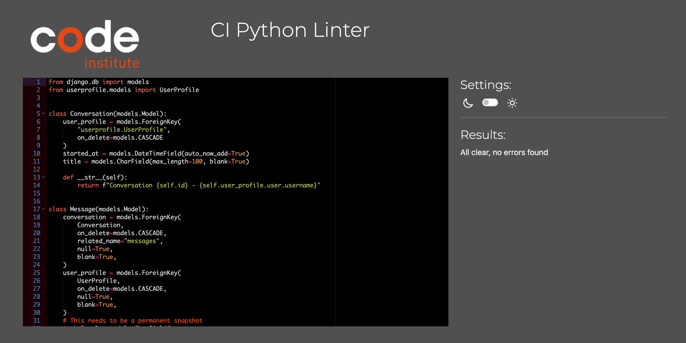
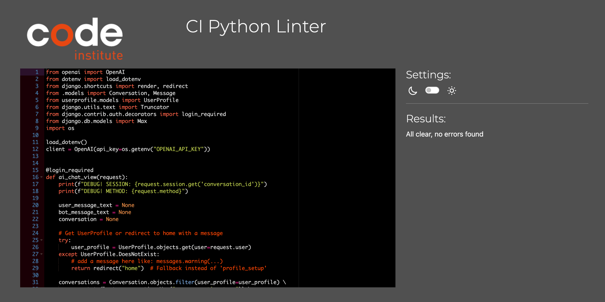

# **TESTING**

The following testing has been carried out.

## **Code Validation**

### **Python**

We have used the recommended [PEP8 CI Python Linter](https://pep8ci.herokuapp.com) to validate the following Python files.

| Directory | File | URL | Screenshot | Notes |
| --- | --- | --- | --- | --- |
| tech_buddy_project | [settings.py](tech_buddy_project/settings.py) | [PEP8 CI Link](https://pep8ci.herokuapp.com/https://raw.githubusercontent.com/apeskinian/tech_buddy/main/tech_buddy_project/settings.py) |  | All clear, no errors found. |
| tech_buddy | [urls.py](tech_buddy/urls.py) | [PEP8 CI Link](https://pep8ci.herokuapp.com/https://raw.githubusercontent.com/apeskinian/tech_buddy/main/tech_buddy/urls.py) |  | All clear, no errors found. |
| tech_buddy | [views.py](tech_buddy/views.py) | [PEP8 CI Link](https://pep8ci.herokuapp.com/https://raw.githubusercontent.com/apeskinian/tech_buddy/main/tech_buddy/views.py) |  | All clear, no errors found. |
| openaichat | [models.py](openaichat/models.py) | [PEP8 CI Link](https://pep8ci.herokuapp.com/https://raw.githubusercontent.com/apeskinian/tech_buddy/main/openaichat/models.py) |  | All clear, no errors found. |
| openaichat | [views.py](openaichat/views.py) | [PEP8 CI Link](https://pep8ci.herokuapp.com/https://raw.githubusercontent.com/apeskinian/tech_buddy/main/openaichat/views.py) |  | All clear, no errors found. |
